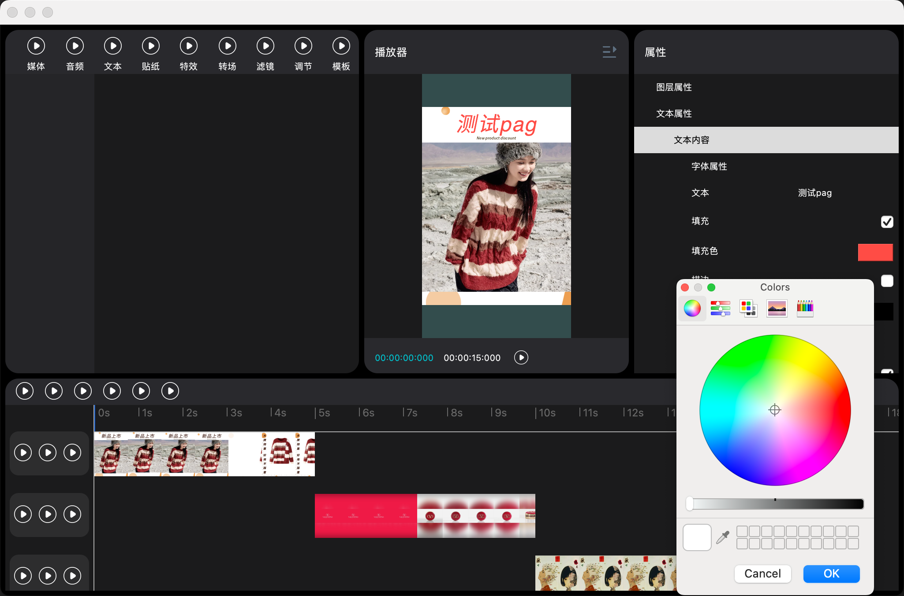

# DreamCreator

## 项目简介

此项目是基于QT+OpenGL实现的视频播放器。项目中主要的功能包括：
- **基于QT的界面样式**
- **OpenGL图形渲染**
- **opencv视频编解码**
- **Tencent PAG支持**

## 预览效果


## MACOS编译

- **依赖Qt5**

- **第一次拉取代码需要编译第三方库**

```
终端执行`buildThirdParty`编译三方库
```

- **编译工程**

```
根目录下终端执行`build.sh Debug` or `build.sh Release` 编译工程
```
编译完后可执行文件在`build/bin/`目录下